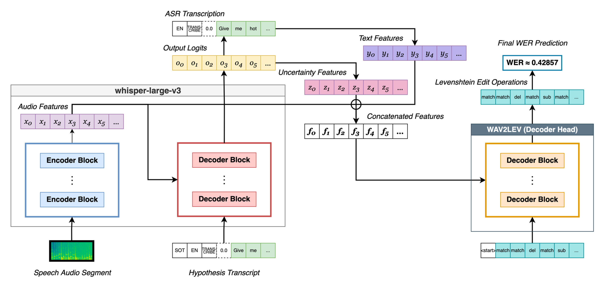
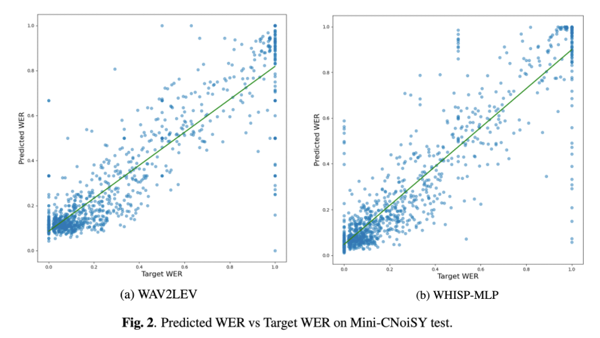

# WAV2LEV

WAV2LEV is a model for reference-free ASR quality estimation that predicts the underlying sequence of Levenshtein edit operations (substitutions, deletions, insertions, matches) token-by-token, rather than estimating word error rate (WER) as a single scalar. WER is derived from the predicted edit sequence, yielding fine-grained, word-level error estimates that are more informative than those of direct WER estimators.



## Model Architecture

WAV2LEV is a transformer decoder head built on top of **Whisper large-v3**. At each inference step it autoregressively predicts the next edit operation in the sequence `[<start>, op₁, op₂, …, <end>]`, where each opᵢ ∈ {ins, sub, del, match}.

The decoder receives three concatenated input streams as cross-attention memory:

| Stream | Source | Description |
|--------|--------|-------------|
| Audio features | Whisper encoder | Frame-level hidden states (1280-dim) |
| Uncertainty features | Whisper decoder logits | 13 per-token statistics (entropy, top-2 probs, margin, ratio, Gini impurity, cumulative top-3/5/10 mass, normalised exponential entropy, hypothesis token probability, NLL) |
| Text embeddings | Whisper decoder embeddings | Token-level embeddings of the hypothesis transcript (1280-dim) |

**Decoder configuration:** 12 blocks · 16 attention heads · 1024-dim · GELU activations · 10% dropout

**Training:** token-level cross-entropy with label smoothing 0.05 · teacher forcing · AdamW (weight decay 1e-4) · linear warmup (1% of steps) · mixed precision · gradient accumulation (2 steps) · gradient clipping (max norm 1.0)

## Mini-CNoiSY Dataset

Mini-CNoiSY (**Mini**ature **C**lean-**Noi**sy **S**peech from **Y**ouTube) is a bespoke 354-hour noisy speech corpus designed to provide reliable ground-truth WER labels while covering a diverse range of noise conditions.

**Construction:**
1. Clean speech segments sourced from YODAS2 and filtered for high-confidence transcription (agreement between manual and Whisper large-v3 labels, WER < 10%)
2. Artificial noising pipeline applied to each segment:
   - Room impulse response convolution (DNS5 RIRs)
   - Additive background noise (SNR ~ Uniform(−5, 40) dB)
   - Bandwidth limitation (16 kHz → 8 kHz → 16 kHz)
   - Quantile clipping
   - Codec compression (mp3 / ogg)
   - Additive Gaussian white noise
   - Simulated packet loss
3. Background noise sourced from YouTube videos matched by camera device filename prefix; speech-containing segments removed using a VAD model

**Corpus statistics:**

| Split      | Segments | Duration  | Avg length | Avg WER |
|------------|----------|-----------|------------|---------|
| Train      | 88,177   | 346.44 hr | 14.14 s    | 27.88%  |
| Validation | 1,003    | 3.95 hr   | 14.17 s    | 30.87%  |
| Test       | 1,003    | 3.95 hr   | 14.16 s    | 31.62%  |

Dataset repository: [https://github.com/HarveyRDonnelly/MiniCNoiSY](https://github.com/HarveyRDonnelly/MiniCNoiSY)

## Results

Evaluation on the Mini-CNoiSY test set. TER (Token Error Rate) measures sequence-level edit accuracy of the predicted Levenshtein operations.

| Model       | RMSE ↓  | PCC ↑  | TER ↓  |
|-------------|---------|--------|--------|
| WAV2LEV     | 0.1488  | 0.8971 | 0.2972 |
| WHISP-MLP   | 0.1376  | 0.9101 | —      |
| Fe-WER\*    | 0.2333  | 0.8220 | —      |

Mean predicted WER: 0.3178 ± 0.2704 · Mean true WER: 0.3162 ± 0.3313



\* Fe-WER reimplemented: HuBERT large + XLM-RoBERTa large, mean pooling, 3-layer MLP.

## Replication

### 1. Environment setup

```bash
git clone https://github.com/HarveyRDonnelly/WAV2LEV.git
cd WAV2LEV
pip install torch torchaudio transformers datasets dask pandas numpy scipy \
            scikit-learn wandb tqdm openai-whisper librosa soundfile \
            nemo_text_processing
```

### 2. Download Mini-CNoiSY

Follow the instructions at [https://github.com/HarveyRDonnelly/MiniCNoiSY](https://github.com/HarveyRDonnelly/MiniCNoiSY) to download the corpus. Place the parquet splits at:

```
mini_cnoisy/data/cnoisy_final_v3/train.parquet
mini_cnoisy/data/cnoisy_final_v3/validation.parquet
mini_cnoisy/data/cnoisy_final_v3/test.parquet
```

Paths are configurable in `utils/config.py` (`CNOISY_DATASET_PATH`).

### 3. Precompute Whisper embeddings

WAV2LEV and WHISP-MLP use precomputed Whisper encoder states and uncertainty features to avoid re-running the encoder at every training step:

```bash
python main.py --precomp_embeddings
```

Embeddings are written to `./whisp_embeddings/` (configurable via `EMBEDDINGS_PRECOMP_PATH` in `utils/config.py`). The script is resumable — it skips already-processed segments.

### 4. Train

**WAV2LEV** (experiment 10):
```bash
python main.py --exp 10 --model whisper
```

**WHISP-MLP** (experiment 9):
```bash
python main.py --exp 9 --model whisper
```

**Fe-WER** (experiment 8, loads raw audio — does not require precomputed embeddings):
```bash
python main.py --exp 8 --model whisper
```

All experiments log metrics and plots to Weights & Biases. Model weights are saved to `mini_cnoisy/weights/` after each epoch (`_recent.pt`) and whenever validation RMSE improves (`_best.pt`).

Hyperparameters are defined in `utils/config.py` under the corresponding `*_MODEL_CONFIG` dictionaries.

### 5. Evaluate on the test set

```bash
python main.py --exp 10 --model whisper --test \
    --weights exp_10_whisper_<timestamp>_best.pt
```

Replace `<timestamp>` with the run timestamp printed during training (or use `_recent.pt` for the final checkpoint). The evaluation script reports RMSE, PCC, Spearman correlation, and Token Error Rate, and logs detailed per-segment predictions to W&B.

## Citation

If you use WAV2LEV or Mini-CNoiSY in your work, please cite:

```bibtex
@inproceedings{donnelly2026wav2lev,
  title     = {{WAV2LEV}: Token-Level {L}evenshtein Edit Prediction for Reference-Free {ASR} Quality Estimation},
  author    = {Donnelly, Harvey},
  booktitle = {Proceedings of the IEEE International Conference on Acoustics, Speech and Signal Processing (ICASSP)},
  year      = {2026}
}
```
